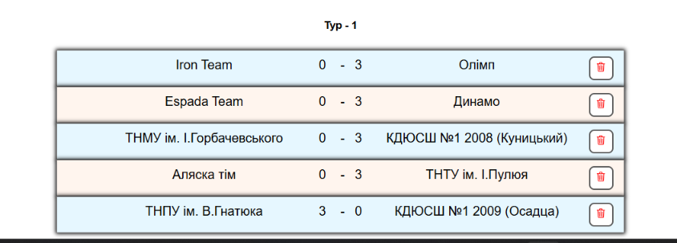
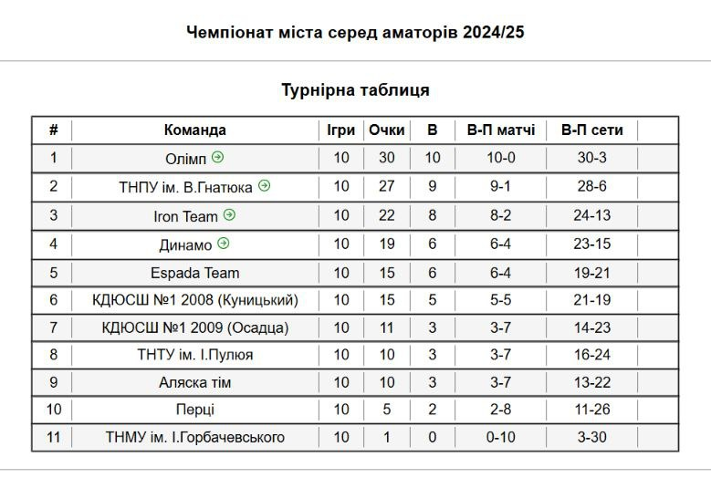

# 🏐 Tournament App

**Tournament App** is a specialized web application designed to track match results and manage league tables for regional volleyball competitions. The application has been successfully utilized in production for two full regular seasons, proving its reliability and practical value.

**🔗 Live Demo:** [View Project](https://olehkuts.github.io/tournament_app/)

## 🎯 Project Overview

This project was developed to solve the logistical challenge of managing regional sports data. It automates the calculation of league standings based on specific volleyball tie-breaking criteria (points, matches won, set ratios, etc.), moving away from manual spreadsheets to a dedicated digital tool.

## ✨ Key Features

- **Comprehensive Tournament Management:** Add, edit, or remove teams and match results on the fly.
- **Dynamic Standings:** Automatically calculates the league table according to official volleyball priority rules.
- **Visual Progression:** Displays matches sorted by rounds (stages) for better readability.
- **JSON Data Portability:** Built-in Export/Import functionality allowing users to save the entire tournament state as a JSON file and load it on any other device or browser.
- **Persistent Storage:** Uses `LocalStorage` to ensure data remains available even after refreshing the page or closing the browser.
- **Final Stage Tracking:** Visual indicators to show which teams qualify for the playoff/final phase.

## 🛠 Tech Stack

- **React** (Functional Components)
- **Custom Hooks** (For centralized business logic and data management)
- **React Router DOM** (Multi-page navigation)
- **Copy-to-clipboard** (Enhanced UX for data sharing)
- **Local Storage API** (Persistent data storage)

## 📸 Screenshots

| Match Results (Stage View)                   | Final Season Standings                               |
| :------------------------------------------- | :--------------------------------------------------- |
|  |  |

## 📂 Application Structure

- **Standings & Matches:** The main dashboard showing the live table and a chronological list of matches with editing/deletion capabilities.
- **Settings:** The administrative hub to change the tournament name, manage the team list, and create new matches.
- **Data Import/Export:** A dedicated utility for backing up tournament data or migrating results between different environments.

## 🚀 Local Setup

1. **Clone the repository:**
   ```bash
   git clone https://github.com
   ```
2. **Navigate to the project directory:**
   ```bash
   cd tournament_app
   ```
3. **Install dependencies:**
   ```bash
   npm install
   ```
4. **Start the development server:**
   ```bash
   npm start
   ```

---

_Developed by [Oleh Kuts](https://github.com/OlehKuts)_
